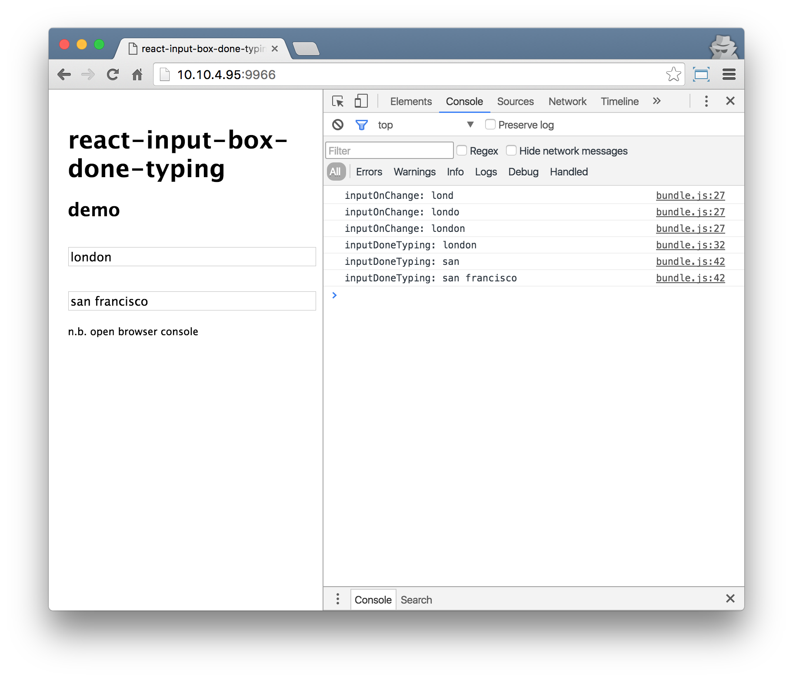

# react-input-box-done-typing

A React component that triggers a callback when the user has finished typing in the input text box

## Usage

Install via npm using the following npm command:

```shell
npm i -S react-input-box-done-typing
```

Include the component within your React application:

```javascript
import InputBoxDoneTyping from 'react-input-box-done-typing';
```

And use it inside your container:

```javascript
<InputBoxDoneTyping
  inputId="input-box-done-typing"
  inputClassName="form-control"
  inputPlaceholde="Start typing ..."
  inputOnChange={(value) => { console.log('inputOnChange:', value); } }
  inputDefaultValue="lon"
  doneTypingInterval={2000}
  inputDoneTyping={(value) => { console.log('inputDoneTyping:', value); } }
  />
```

## Attributes

Name | Type | Required | Default | Options
--- | --- | --- | --- | ---
`inputId` | `string` | no | - | -
`inputClassName` | `string` | no | - | -
`inputPlaceholder` | `string` | no | - | -
`inputAutoComplete` | `string` | no | on | ['on', 'off']
`inputOnChange` | `function` | no | - | -
`inputDefaultValue` | `string` | no | - | -
`doneTypingInterval` | `number` | no | 500 (milliseconds) | -
`inputDoneTyping` | `function` | yes | - | -


## Demo

Clone or download this GitHub repository then run a live demo using the following npm commands:

```shell
npm i
npm run demo
```

The script will automatically open a tab of your default browser;
you will be able to see the **InputBoxDoneTyping** component in action


